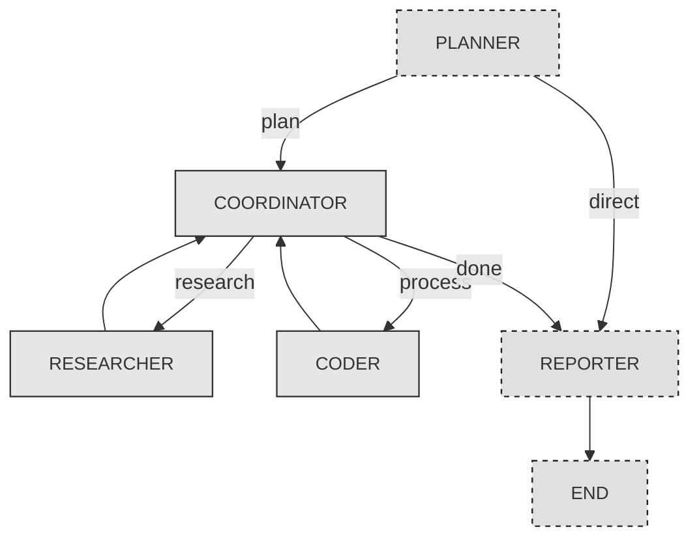

# ReMind

ReMind is a research workflow prototype inspired by OpenAI’s [Deep Research](https://openai.com/index/introducing-deep-research/) and ByteDance’s [DeerFlow](https://github.com/bytedance/deer-flow). This implementation of the core logic does not leverage any kind of external library like langgraph or agentic abstraction

Currently, the project is backend-only and does not include a frontend or UI.

## API Key Setup

To run ReMind, set the following API keys as environment variables:

- `OPENAI_API_KEY` — for OpenAI's language models
- `ANTHROPIC_API_KEY` — for Claude models
- `TAVILY_API_KEY` — for web search capabilities
- `JINA_API_KEY` — for crawling functionality

## Running the Workflow

From the root directory, execute the following command:

```bash
python3 -m ReMind.main --query "<research-statement>"
```

## ReAct Agent Design

The core agent in **ReMind** uses the [ReAct](https://arxiv.org/abs/2210.03629) pattern to iteratively reason and interact with tools.

The loop involves:

- Thoughtfully analyzing the task  
- Selecting and invoking an appropriate tool  
- Observing the result  
- Repeating the cycle until the task is resolved  

All of these steps are autonomously driven by the LLM with no human-in-the-loop, making it a powerful demonstration of agentic reasoning.

## State Machine Architecture

The state machine logic is implemented in `state_machine.py` and governs the flow of execution through multiple agent roles:

- **Planner**: Breaks down the input query into actionable steps  
- **Coordinator**: Routes each step to the appropriate agent — either a researcher or a coder  
- **Researcher**: A ReAct agent using `web search` and `crawler` tools to find relevant information  
- **Coder**: A ReAct agent capable of performing analysis and computation using Python  
- **Reporter**: Synthesizes results into a final structured report  


